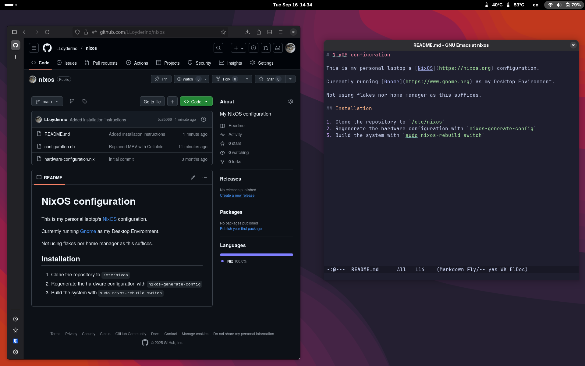

# NixOS configuration

This is my personal laptop's [NixOS](https://nixos.org) configuration.

Currently running [Gnome](https://www.gnome.org) as my Desktop Environment.

Not using flakes nor home manager as this suffices.

## Screenshot

## Installation

1. Clone the repository to `/etc/nixos`
2. Regenerate the hardware configuration with `nixos-generate-config`
3. Build the system with `sudo nixos-rebuild switch`
